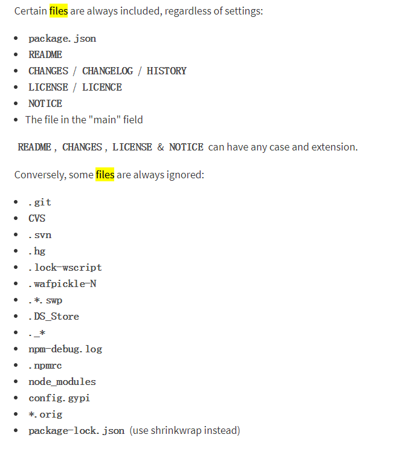

## package.json 中 files 字段的作用

**直接参考[英文文档](https://docs.npmjs.com/files/package.json)**

The optional files field is an array of file patterns that **describes the entries to be included when your package is installed as a dependency.** File patterns follow a similar syntax to .gitignore, but reversed: including a file, directory, or glob pattern (_, \*\*/_, and such) will make it so that file is included in the tarball when it's packed. Omitting the field will make it default to ["*"], which means it will include all files.

Some special files and directories are also included or excluded regardless of whether they exist in the files array (see below).

You can also provide a .npmignore file in the root of your package or in subdirectories, which will keep files from being included. At the root of your package it will not override the "files" field, but in subdirectories it will. The .npmignore file works just like a .gitignore. If there is a .gitignore file, and .npmignore is missing, .gitignore's contents will be used instead.

Files included with the "package.json#files" field cannot be excluded through .npmignore or .gitignore.



### NOTICE

是不是很懵逼？看到我加粗的文字了没有？ 那才是重点！

**当包作为依赖安装时指定哪些文件可以作为入口文件导出**

```bash
npm i af-webpack --save
```

```js
// 如果指定了files字段你可以这样require相关模块：

require("af-webpack");
require("af-webpack/dev");
require("af-webpack/build");
require("af-webpack/getConfig");
require("af-webpack/getUserConfig");
```
