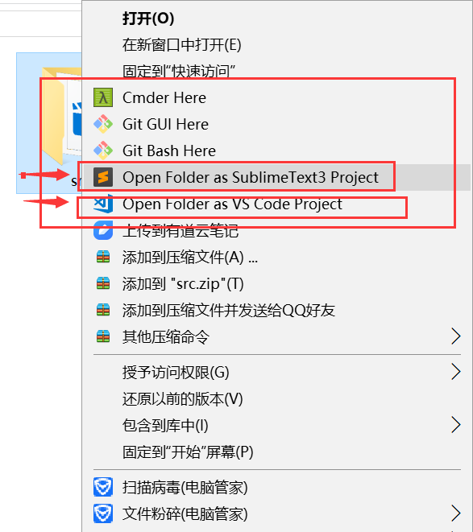

# 将 Sublime Text 添加到鼠标右键菜单

**该方法同样实用 VSCODE,ATOM 等 IDE，reg 文件对应位置修改一下即可**



安装 Sublime Text 3 鼠标右键菜单中没有“Open with Sublime Text”的选项，本着自己动手，丰衣足食的优良传统，决定自己动手添加。具体步骤如下：

## 文件右键菜单添加“Open with Sublime”

* 1、win+R 打开运行，并输入 regedit，打开注册表;
* 2、在左侧列表中依次打开\HKEY_CLASSES_ROOT\*\shell\;
* 3、在 shell 下新建项 Sublime ,将默认值写改为 “Open with Sublime”（这是现实在右键菜单中的名称）;
* 4、在 Subline 下新建字符串值 Icon,将数值写改为“D:\Program Files\Sublime Text 3\sublime_text.exe,0”;
* 5、在 Sulime 下新建项 Command，将默认值修改为“D:\Program Files\Sublime Text 3\sublime_text.exe,%1”;

## 文件夹右键菜单添加“Open with Sublime”

* 1、win+R 打开运行，并输入 regedit，打开注册表；
* 2、在左侧列表中依次打开\HKEY_CLASSES_ROOT\Directory\shell\；
* 3、在 shell 下新建项 Sublime ,将默认值写改为 “Open with Sublime”（这是现实在右键菜单中的名称）；
* 4、在 Subline 下新建字符串值 Icon,将数值写改为“D:\Program Files\Sublime Text 3\sublime_text.exe,0”；
* 5、在 Sulime 下新建项 Command，将默认值修改为“D:\Program Files\Sublime Text 3\sublime_text.exe,%1”；

## 使用注册文件添加到右键(推荐使用)

* 1、新建一个 REG 文件：addRight.reg
* 2、添加内容：

```java
Windows Registry Editor Version 5.00
; Open files
[HKEY_CLASSES_ROOT\*\shell\SublimeText3]
@="Edit with SublimeText3"
"Icon"="C:\\Program Files\\Sublime Text 3\\sublime_text.exe,0"
[HKEY_CLASSES_ROOT\*\shell\SublimeText3\command]
@="\"C:\\Program Files\\Sublime Text 3\\sublime_text.exe\" \"%1\""
; This will make it appear when you right click ON a folder
; The "Icon" line can be removed if you don't want the icon to appear
[HKEY_CLASSES_ROOT\Directory\shell\SublimeText3]
@="Open Folder as SublimeText3 Project"
"Icon"="\"C:\\Program Files\\Sublime Text 3\\sublime_text.exe\",0"
[HKEY_CLASSES_ROOT\Directory\shell\SublimeText3\command]
@="\"C:\\Program Files\\Sublime Text 3\\sublime_text.exe\" \"%1\""
; This will make it appear when you right click INSIDE a folder
; The "Icon" line can be removed if you don't want the icon to appear
[HKEY_CLASSES_ROOT\Directory\Background\shell\SublimeText3]
@="Open Folder as SublimeText3 Project"
"Icon"="\"C:\\Program Files\\Sublime Text 3\\sublime_text.exe\",0"
[HKEY_CLASSES_ROOT\Directory\Background\shell\SublimeText3\command]
@="\"C:\\Program Files\\Sublime Text 3\\sublime_text.exe\" \"%V\""
```

* 3、双加执行，然后右键就会有 open with sublime 选项了。
* **注意：将代码中的 C:\\Program Files 路径替换成你的 sublime 的安装路径**
