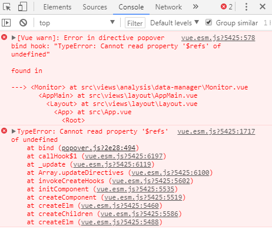

`v-popover:popover1`这个指令使用的时候`ref="popover1"`必须已经存在不然就会：


也就是说：`<el-popover></el-popover>`组件在前`v-popover:popover1`在后，**顺序不能变！！**
```html
<!-- 正确 -->
<el-popover
    ref="popover1"
    placement="top-start"
    width="200"
    trigger="hover"
    :content="scope.row.provinceName">
</el-popover>
<el-button type="text" size="small" v-popover:popover1>详情</el-button>
```
```html
<!-- 错误 -->
<el-button type="text" size="small" v-popover:popover1>详情</el-button>
<el-popover
    ref="popover1"
    placement="top-start"
    width="200"
    trigger="hover"
    :content="scope.row.provinceName">
</el-popover>
```
