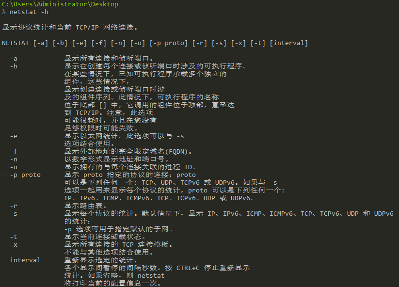
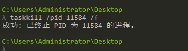

## window&lilux 查询端口被占用及 kill 该进程

### Windows

```sh
# netstat 使用说明
netstat -h
```



```sh
# 列出netstat状况并且找出含有字符串8080的条目
# 最后一列是PID
netstat -ano|findstr "8080"
```


```sh
# tasklist 列出当前所有任务列表， 找出含有端口对应的PID的列
# 列出了当前是哪个任务占用了8080端口
tasklist|fintstr "11584"
```


```sh
# kill掉这个进程
taskkill /pid 11584 /f
```



### LILUX

查询端口是否被占用，被哪个进程占用有两种方式：1、netstat -anl | grep "8080" ；2、lsof -i:8080

终止进程的方式：kill pid
